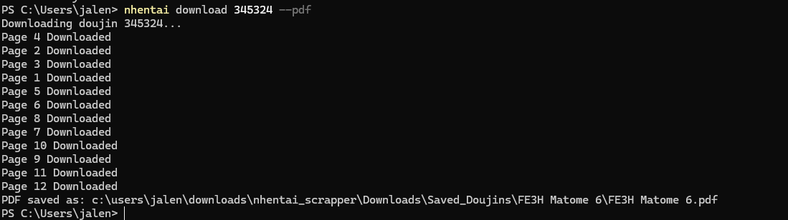
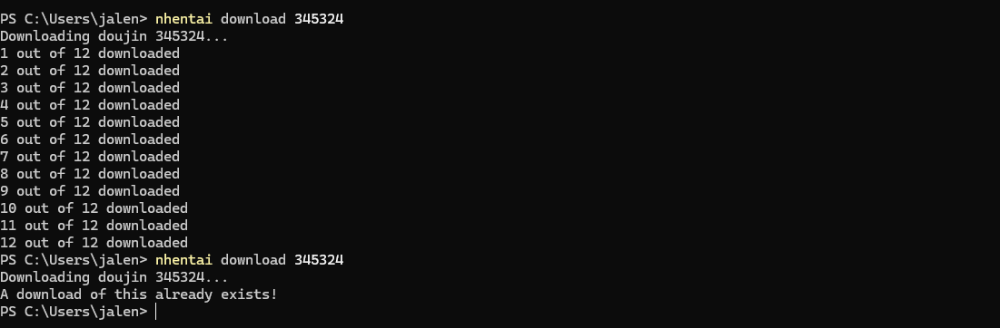
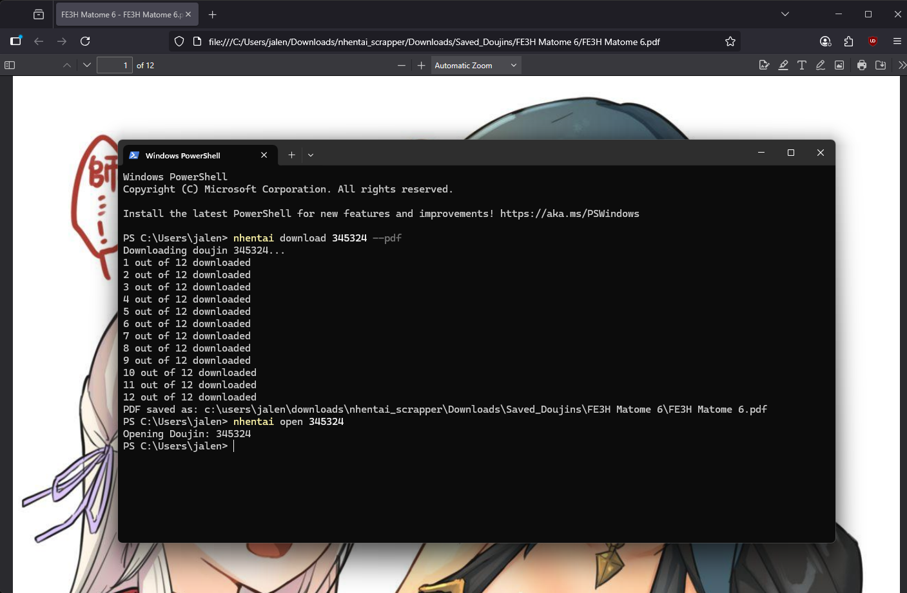
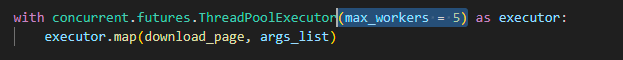

# nHentai scrapper/downloader

---

This is a CLI tool to download doujins from nHentai.net without having to sign in 
Also does not require you to input cookies as it will automatically create and fetch for you


## Installation

1. **Clone the repository**
```bash
git clone https://github.com/TheDude2701/nhentai_scrapper.git
cd nhentai_scrapper
```
2. **Install Dependencies**
```bash
pip install -r requirements.txt
```
3. **INSTALL PLAYWRIGHT BROWSERS⚠️(IMPORTANT!!!)**
```bash
playwright install
```
4. **Install**
```bash
pip install -e .
```

## USAGE

To download a specific doujin:
```bash
nhentai download 123123 
```
This will download the img files into the \downloads\Saved_Doujins\ Folder

To download and convert to a pdf:
```bash
nhentai download 123123 --pdf
```



When you try to download a doujin you've already downloaded

To delete a downloaded doujin:
```bash
nhentai delete 123123
```


To lookup the corresponding code for the title of a doujin:
```bash
nhentai lookup "title"
```

To open a downloaded pdf of a doujin:
```bash
nhentai open 123123
```

    ⚠️This will open the pdf in your default browser (Not incognito)⚠️

---

## Note
⚠️I am aware that potentially for some doujins a few pages returns 404 unable to download. This is likely due to their site's cloudflare blocking the script, unfortunately there isn't much I can do however this has only happened to me for the newer doujins eg. 600001, 600002

Side note: It seems that the doujins with code < 400000 have their img src as jpg files while the newer ones are in webp format.

If you feel that the pages are downloading too slow, you can try and changing the max_workers inside download_doujin(), although I wouldn't recommmend setting it too high as you might run the risk of getting blocked by cloudflare.



Lastly
Sorry if the features are kind of lacking (notably not being able to search by tags and bulk download)


