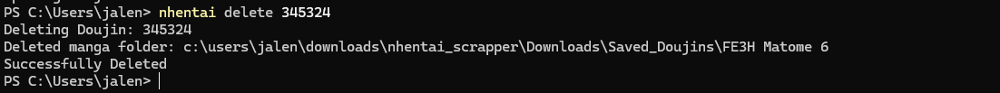

# nHentai scrapper/downloader

---

This is a CLI tool to download doujins from nHentai.net without having to sign in 
Also does not require you to input cookies as it will automatically create and fetch for you


## Installation

1. **Download directly with pip**
```bash
pip install git+https://github.com/TheDude2701/nhentai_scrapper.git
```
---
1. **Clone the git Repo**
```bash
git clone https://github.com/TheDude2701/nhentai_scrapper.git
cd nhentai_scrapper
```
2. **Install Dependencies**
```bash
pip install -r requirements.txt
```
3. **INSTALL PLAYWRIGHT BROWSERS⚠️(IMPORTANT!!!)**
```bash
playwright install
```
4. **Install**
```bash
pip install .
```

## USAGE

To download a specific doujin:
```bash
nhentai download 123123 
```
This will download the img files into the \downloads\Saved_Doujins\ Folder

To download and convert to a pdf:
```bash
nhentai download 123123 --pdf
```


Note: It will take longer for larger doujins with more pages, for 200 pages it'll take ~ 1.5min
Sorry, I know it's kinda slow...


When you try to download a doujin you've already downloaded

To delete a downloaded doujin:
```bash
nhentai delete 123123
```


To lookup the corresponding code for the title of a doujin:
```bash
nhentai lookup --title "title" or --code "sauce"
```


To open a downloaded pdf of a doujin:
```bash
nhentai open 123123
```

    ⚠️This will open the pdf in your default browser (Not incognito)⚠️

To check all of your downloaded doujins:
```bash
nhentai doujins
```
---

## Note
⚠️Sometimes it may return 403 error because of cloudflare, just try again and redownload.

Sorry if the features are kind of lacking (notably not being able to search by tags and bulk download)


